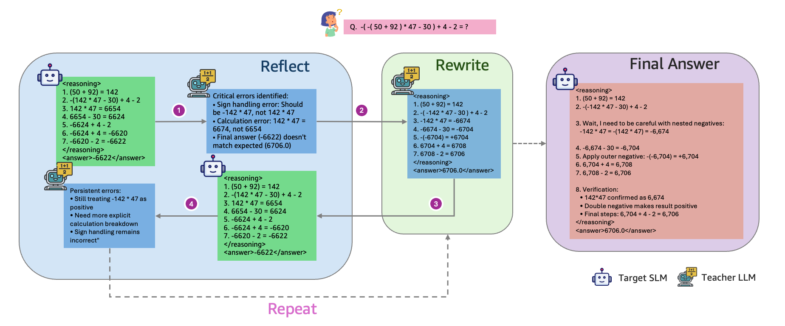
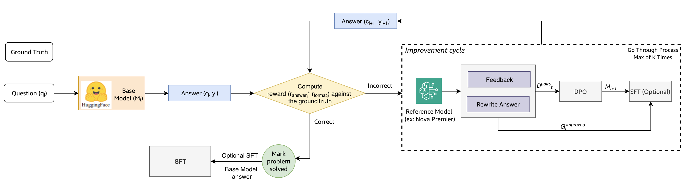

# R³: Reflect, Rewrite, Repeat - Resource-Efficient Reasoning Enhancement

A novel, resource-efficient framework for enhancing language model reasoning capabilities through iterative refinement with minimal data requirements.

## Overview

Contemporary advancements in language model reasoning typically require computationally intensive reinforcement learning (RL) and massive datasets, creating barriers for resource-constrained teams. This work demonstrates that high-quality, iterative training on minimal data can rival modern RL approaches.

Our **R³ (Reflect, Rewrite, Repeat)** framework combines Direct Preference Optimization (DPO) and Supervised Fine-Tuning (SFT) with selective guidance from larger models, iteratively refining solutions through a pedagogical cycle. Remarkably, we achieve substantial performance improvements using **only 700 basic arithmetic training samples**, in stark contrast to the hundreds of thousands of examples typically required by RL-based systems.

### Key Results

Using Qwen 2.5 7B and Qwen 2.5 Math 7B as base models, our method shows meaningful performance improvements across arithmetic, symbolic, and cognitive reasoning benchmarks:

- **GSM8K**: 83.1% → 88.6% (+5.5%)
- **AIME'25@10**: 20.0% → 30.0% (+10.0%)
- **LastLetterConcat**: 40.7% → 53.3% (+12.6%)

The model-agnostic nature of R³ is further demonstrated through substantial improvements when applied to Mistral and LLaMA-based models. Our results suggest that reasoning improvements need not strictly depend on large-scale data—by emphasizing strategically curated training grounded in foundational principles, we achieve competitive generalization with minimal resource overhead.

## The R³ Framework



The R³ cycle operates in three phases:

### 1. Reflect
The target model attempts to solve a problem, and a teacher model (e.g., AWS Bedrock models like Claude or Nova) evaluates the solution, identifying:
- Critical errors in reasoning
- Sign handling mistakes
- Calculation errors
- Format issues
- Persistent patterns of mistakes

### 2. Rewrite
Based on the feedback, an improved solution is generated. The reference model provides:
- Corrected reasoning steps
- Explicit calculation breakdowns
- Proper handling of edge cases
- Verified final answers

### 3. Repeat
The cycle continues until the solution converges to correctness. The preference pairs (original vs. improved solutions) are then used for DPO training, enabling the model to learn from its mistakes.

## Training Pipeline



The complete training pipeline consists of:

1. **Initial Answer Generation**: Base model (from HuggingFace) generates an answer for each question
2. **Reward Computation**: Answers are evaluated against ground truth, computing both answer correctness and format compliance
3. **Improvement Cycle** (for incorrect answers):
   - Reference model provides feedback on errors
   - Improved answer is generated based on feedback
   - DPO training is performed on preference pairs (rejected vs. chosen)
   - Process repeats up to K times until convergence
4. **Optional SFT**: When problems are successfully solved, high-quality reasoning traces can be used for supervised fine-tuning

This creates a dynamic learning environment analogous to how humans learn mathematics: through problem-solving, receiving feedback, and refining approaches.

## Key Features

- **Resource-Efficient**: Achieves strong results with minimal training data (700 samples vs. hundreds of thousands)
- **Model-Agnostic**: Works with various model families (Qwen, Mistral, LLaMA)
- **Iterative Refinement**: R³ cycle progressively improves reasoning quality
- **High-Quality Data Generation**: Produces SFT data with high-fidelity reasoning traces as a byproduct
- **Structured Reasoning Format**: Enforces clear separation of reasoning steps and final answers
- **Adaptive Feedback Mechanism**: Leverages AWS Bedrock models for expert guidance
- **Progressive Learning**: Combines DPO and optional SFT for comprehensive training
- **Robust Training Infrastructure**:
  - Parameter-efficient training with LoRA adapters
  - Support for 4-bit and 8-bit quantization
  - Checkpoint management with S3 integration
  - Comprehensive visualization and metrics tracking
- **Interactive Configuration**: User-friendly setup for training parameters

## Requirements

- Python 3.8+ (recommend python 3.11.10)
- PyTorch
- Transformers library with PEFT support
- AWS account with Bedrock access
- Hugging Face datasets
- Weights & Biases (optional)

## Installation

```bash
# Create conda env
conda create --name rf-dpo python=3.11.10
conda activate rf-dpo

# Install dependencies
pip install -r requirements.txt
pip install flash-attn --no-build-isolation

# Configure AWS credentials for Bedrock access
aws configure
```

## Usage

### Interactive Mode

The easiest way to start is with interactive configuration:

```bash
python main.py --interactive
```

This will guide you through selecting models, datasets, training parameters, and other options.

### Command Line Mode

For scripted or batch training:

```bash
python main.py \
  --model_name "Qwen/Qwen2.5-7B-Instruct" \
  --model_family "qwen" \
  --use_lora \
  --lora_r 16 \
  --bedrock_model_basic "c35_haiku" \
  --dataset_source "gsm8k" \
  --max_samples 700 \
  --epochs 1 \
  --checkpoint_interval 50 \
  --wandb_project "r3_reasoning"
```

### Key Command Line Arguments

- **Model Configuration**:
  - `--model_name`: HuggingFace model identifier or local path
  - `--model_family`: Model architecture family (`llama` or `qwen`)
  - `--use_lora`: Enable LoRA for parameter-efficient fine-tuning
  - `--lora_r`: LoRA attention dimension
  - `--use_4bit`: Enable 4-bit quantization (with LoRA)

- **Training Parameters**:
  - `--dpo_learning_rate`: Learning rate for DPO training
  - `--use_sft`: Enable Supervised Fine-Tuning after successful verification
  - `--beta`: DPO beta parameter (preference strength)
  - `--epochs`: Number of training epochs

- **Feedback Configuration**:
  - `--bedrock_model_basic`: AWS Bedrock model for standard feedback (e.g., Claude Haiku, Nova)
  - `--bedrock_model_advanced`: Enhanced model for bucket list problems
  - `--improvement_generator`: Model to use for improvements (`bedrock` or `target`)
  - `--improvement_max_attempts`: Maximum attempts to improve an answer

- **Dataset Options**:
  - `--dataset_source`: Dataset name on HuggingFace or local file path
  - `--dataset_split`: Dataset split for HuggingFace datasets
  - `--max_samples`: Limit dataset size (we recommend starting with 700 samples)

- **Infrastructure**:
  - `--checkpoint_path`: Directory for saving checkpoints
  - `--s3_bucket_name`: S3 bucket for checkpoint storage
  - `--wandb_project`: Weights & Biases project name

## Evaluation

### Standard Evaluation

Evaluate trained models on benchmark datasets:

```bash
python evaluation.py \
  --s3_folder "your-experiment-folder" \
  --bucket "your-s3-bucket" \
  --dataset_type "gsm8k" \
  --batch_size 4 \
  --max_samples 500
```

### Comprehensive Model Assessment (Alternative Tool)

For in-depth analysis of mathematical reasoning capabilities across multiple dimensions, use the standalone `model_evaluator.py` tool:

```bash
python model_evaluator.py \
  --models "Qwen/Qwen2.5-7B-Instruct" "meta-llama/Llama-3.1-8B-Instruct" \
  --interactive
```

This comprehensive assessment tool provides:
- **Multi-dimensional evaluation** across 8 mathematical reasoning categories:
  - Arithmetic operations
  - Algebraic reasoning
  - Numerical computation
  - Mathematical proof
  - Probabilistic reasoning
  - Sequential reasoning
  - Geometric understanding
  - Edge case handling
- **Interactive assessment** with adaptive follow-up questions
- **Rich visualizations**: Radar charts, heatmaps, and performance comparisons
- **Detailed reports**: Strengths/weaknesses analysis and problem-solving approach insights
- **Benchmark evaluation**: GSM8K, AIME, AMC, MathQA, MATH datasets

The tool generates:
- `llm_reasoning_comparison_radar.png` - Performance comparison across categories
- `llm_reasoning_comparison_benchmarks.png` - Benchmark performance comparison
- `llm_reasoning_comparison_heatmap.png` - Detailed capability heatmap
- `llm_reasoning_assessment_report.json` - Structured results data
- `llm_reasoning_assessment_report.md` - Human-readable analysis

**Note:** `model_evaluator.py` is independent of the training pipeline and can be used to assess any compatible model, including base models, checkpoints, or AWS Bedrock models.

## Contributors

- @jaeohwoo
- @florawan
- @munkim
- @haochenx


## Citation

If you use this framework in your research, please cite:

```bibtex
@inproceedings{wang2026reflect,
  title={Reflect, Rewrite, Repeat: How Simple Arithmetic Enables Advanced Reasoning in Small Language Models},
  author={Mengdie Flora Wang and Haochen Xie and Mun Young Kim and Baishali Chaudhury and Meghana Ashok and Suren Gunturu and Sungmin Hong and Jae Oh Woo},
  booktitle={19th Conference of the European Chapter of the Association for Computational Linguistics},
  year={2026},
  url={https://openreview.net/forum?id=RUtFlA6E9O}
}
```

## Acknowledgements

- AWS Bedrock for providing feedback models (Claude, Nova, Mistral, Llama)
- Hugging Face for the Transformers library
- PEFT library for parameter-efficient fine-tuning
- TRL library for DPO implementation inspiration
- The creators of mathematical datasets (GSM8K, AIME, etc.) for benchmark problems

